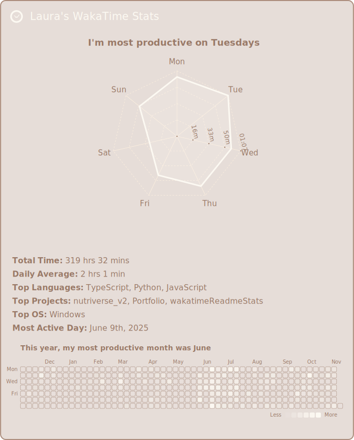

  
  <picture>
    <source
      media="(prefers-color-scheme: dark)"
      srcset="https://readme-typing-svg.demolab.com?font=Jacquard+12&size=67&pause=1000&color=e6ddd8&center=true&vCenter=true&width=700&height=60&lines=Welcome+to+Laura's+GitHub!"
    />
    <source
      media="(prefers-color-scheme: light), (prefers-color-scheme: no-preference)"
      srcset="https://readme-typing-svg.demolab.com?font=Jacquard+12&size=67&pause=1000&color=714542BB&center=true&vCenter=true&width=700&height=60&lines=Welcome+to+Laura's+GitHub!"
    />
    
  </picture>
  

  
&nbsp;

  

 

__Jump to__ [About Me](https://github.com/LauraAllObe#about-me) | [Repositories](https://github.com/LauraAllObe#repositories) | [Tech Stack](https://github.com/LauraAllObe#tech-stack) | [Stats](https://github.com/LauraAllObe#stats) | [Goodbye, and...](https://github.com/LauraAllObe#goodbye-and) | [THANK YOU!!](https://github.com/LauraAllObe#thank-you)
___

## About Me
🐎 Hi, I’m Laura Lovelace. I’m a software engineer with a __B.S. in Computer Science__ from __Florida State University__ (FSU) and an __M.S. in Software Engineering__ from __Stevens Institute of Technology__ (SIT), plus <picture><source media="(prefers-color-scheme: dark)" srcset="https://readme-typing-svg.demolab.com?font=Jacquard+12&size=30&duration=2000&pause=1000&color=e6ddd8&center=true&vCenter=true&width=10&height=18&lines=2" /><source media="(prefers-color-scheme: light), (prefers-color-scheme: no-preference)" srcset="https://readme-typing-svg.demolab.com?font=Jacquard+12&size=30&duration=2000&pause=1000&color=714542BB&center=true&vCenter=true&width=10&height=18&lines=2" /></picture> graduate certificates in __Machine Learning__ and __Cyber Security__.

🎻 I’ve completed two Summer internships (full-stack at NutriverseAI and software architect & engineer at A.I. Blockchain), and I’m currently working part-time at A.I. Blockchain and starting an internship at DK AI. I’m looking for full-time roles starting Spring <picture><source media="(prefers-color-scheme: dark)" srcset="https://readme-typing-svg.demolab.com?font=Jacquard+12&size=30&duration=2000&pause=1000&color=e6ddd8&center=true&vCenter=true&width=40&height=18&lines=2026" /><source media="(prefers-color-scheme: light), (prefers-color-scheme: no-preference)" srcset="https://readme-typing-svg.demolab.com?font=Jacquard+12&size=30&duration=2000&pause=1000&color=714542BB&center=true&vCenter=true&width=40&height=18&lines=2026" /></picture> as a software engineer, AI engineer, or security-focused developer (NYC or remote).

👞 Outside of programming, I enjoy resistance training, cooking, ceramics, skin care, anime, and recently plants and tailoring. I’m fluent in German and English, have studied French for <picture><source media="(prefers-color-scheme: dark)" srcset="https://readme-typing-svg.demolab.com?font=Jacquard+12&size=30&duration=2000&pause=1000&color=e6ddd8&center=true&vCenter=true&width=8&height=18&lines=6" /><source media="(prefers-color-scheme: light), (prefers-color-scheme: no-preference)" srcset="https://readme-typing-svg.demolab.com?font=Jacquard+12&size=30&duration=2000&pause=1000&color=714542BB&center=true&vCenter=true&width=8&height=18&lines=6" /></picture> years, and grew up across Germany, China, and the United States. Personality-wise, I’m very structured with time, calm under pressure, detail-oriented, and pretty introverted, which makes me value focused, thoughtful work over noise.

___
## Repositories:
**[/elevatorKernelModule:](https://github.com/LauraAllObe/elevatorKernelModule)** an elevator kernel module implementation in C (group)  
**[/fat32filesystem:](https://github.com/LauraAllObe/fat32filesystem)** basic fat<picture>
    <source media="(prefers-color-scheme: dark)" srcset="https://readme-typing-svg.demolab.com?font=Jacquard+12&size=30&duration=2000&pause=1000&color=e6ddd8&center=true&vCenter=true&width=20&height=18&lines=32" />
    <source media="(prefers-color-scheme: light), (prefers-color-scheme: no-preference)" srcset="https://readme-typing-svg.demolab.com?font=Jacquard+12&size=30&duration=2000&pause=1000&color=714542BB&center=true&vCenter=true&width=20&height=18&lines=32" />
    
  </picture> file system implementation in C (group)  
**[/hackerNews:](https://github.com/LauraAllObe/hackerNews)** full-stack hacker news web app configured with nginx and gunciorn, implementation in Python (individual)  
**[machineLearningProject:](https://github.com/LauraAllObe/machineLearningProject)** machine learning using combined models implemented in Python (group)  
**[/myNotes:](https://github.com/LauraAllObe/myNotes)** full-stack sticky note (android) mobile application, implementation in Java (group)  
**[/nutritionAnalyzer:](https://github.com/LauraAllObe/nutritionAnalyzer)** NLP-driven ingredient health effect summaries in Jupyter Notebook (individual)  
**[/portfolio:](https://github.com/LauraAllObe/portfolio)** a portfolio showcasing my key projects and standout code snippets, implementation in HTML (individual)  
**[/practicePanther:](https://github.com/LauraAllObe/practicePanther)** full-stack PracticePanther (Law Practice Management Software) implementation in C# (individual)  
**[/proFessUp:](https://github.com/LauraAllObe/proFessUp)** full-stack rateMyProfessor implementation in Javascript (group)  
**[/shell:](https://github.com/LauraAllObe/shell)** a minimal shell implementation in C (group)  
**[/wakatimeReadmeStats:](https://github.com/LauraAllObe/wakatimeReadmeStats)** a code tracking visualizer using WakaTime stats and SVGs, implemented in JavaScript (individual)

__*Note: some group projects were cloned from another directory or repository upon completion*__
___ 
## Tech Stack:
💼 I'm knowledgeable in <picture>
    <source media="(prefers-color-scheme: dark)" srcset="https://readme-typing-svg.demolab.com?font=Jacquard+12&size=30&duration=2000&pause=1000&color=e6ddd8&center=true&vCenter=true&width=30&height=18&lines=13%2B" />
    <source media="(prefers-color-scheme: light), (prefers-color-scheme: no-preference)" srcset="https://readme-typing-svg.demolab.com?font=Jacquard+12&size=30&duration=2000&pause=1000&color=714542BB&center=true&vCenter=true&width=30&height=18&lines=13%2B" />
    
  </picture> __programming languages__, including
<code></code>(C), 
<code></code>(C++), 
<code></code>(C#), 
<code></code>(Python), 
<code></code>(Typescript), 
<code></code>(Javascript), 
<code></code>(Java), 
<code></code>(MySQL), 
<code></code>(PostgreSQL), 
<code></code>(SQLite), 
<code></code>(HTML), 
<code></code>(CSS), and 
<code></code>(Markdown).  

🪵 I'm knowledgeable in <picture>
    <source media="(prefers-color-scheme: dark)" srcset="https://readme-typing-svg.demolab.com?font=Jacquard+12&size=30&duration=2000&pause=1000&color=e6ddd8&center=true&vCenter=true&width=30&height=18&lines=9%2B" />
    <source media="(prefers-color-scheme: light), (prefers-color-scheme: no-preference)" srcset="https://readme-typing-svg.demolab.com?font=Jacquard+12&size=30&duration=2000&pause=1000&color=714542BB&center=true&vCenter=true&width=30&height=18&lines=9%2B" />
    
  </picture> __frameworks & libraries__, including 
<code></code>(React), 
<code></code>(Expo), 
<code></code>(Node.js), 
<code></code>(Next.js), 
<code></code>(.NET MAUI), 
<code></code>(Flask), 
<code></code>(FastAPI), 
Hugging Face Transformers, and 
<code></code>(OpenAI).  

🪑 I'm knowledgeable in <picture>
    <source media="(prefers-color-scheme: dark)" srcset="https://readme-typing-svg.demolab.com?font=Jacquard+12&size=30&duration=2000&pause=1000&color=e6ddd8&center=true&vCenter=true&width=30&height=18&lines=24%2B" />
    <source media="(prefers-color-scheme: light), (prefers-color-scheme: no-preference)" srcset="https://readme-typing-svg.demolab.com?font=Jacquard+12&size=30&duration=2000&pause=1000&color=714542BB&center=true&vCenter=true&width=30&height=18&lines=24%2B" />
    
  </picture> __technologies and tools__, including 
<code></code>(Git), 
<code></code>(GitHub), 
<code></code>(GitLab), 
<code></code>(Jira), 
<code></code>(Docker), 
<code></code>(Vercel), 
<code></code>(Heroku), 
<code></code>(NPM), 
<code></code>(LaTeX), 
<code></code>(Jupyter Notebook), 
<code></code>(Android Studio), 
<code></code>(Visual Studio), 
<code></code>(VSCode), 
<code></code>(Vim), 
<code></code>(JSON), 
<code></code>(Bash), 
<code></code>(Shell), 
<code></code>(PowerShell), 
<code></code>(Anaconda),
<code></code>(VirtualBox), 
<code></code>(Linux), 
<code></code>(Ubuntu), 
<code></code>(Windows), and 
<code></code>(Android).

🦇 I'm knowledgeable in <picture>
    <source media="(prefers-color-scheme: dark)" srcset="https://readme-typing-svg.demolab.com?font=Jacquard+12&size=30&duration=2000&pause=1000&color=e6ddd8&center=true&vCenter=true&width=30&height=18&lines=9%2B" />
    <source media="(prefers-color-scheme: light), (prefers-color-scheme: no-preference)" srcset="https://readme-typing-svg.demolab.com?font=Jacquard+12&size=30&duration=2000&pause=1000&color=714542BB&center=true&vCenter=true&width=30&height=18&lines=9%2B" />
    
  </picture> __Cloud & DevOps__, including 
<code></code>(Amazon AWS), 
<code></code>(Microsoft Azure), 
<code></code>(Linode), 
<code></code>(Firebase), 
Supabase,
<code></code>(MongoDB), 
<code></code>(Nginx), 
Gunicorn, and 
<code></code>(GitHub Actions).

___
## Stats:

  

    
    
    
  

  

    
    
    
  

  

      
      
      
  

___

  <h2 align="left">Goodbye, and...</h2>
  
  
  
  <h2 align="right">THANK YOU!!</h2>

___

